# YatraAI: A Hyper-Personalized Generative AI Travel Planner for India

YatraAI is a full-stack data and AI engineering project that redefines travel planning. It moves beyond generic, keyword-based search to deliver hyper-personalized, narrative-driven itineraries that are factually grounded and immediately actionable.

The project's core mission is to act as an intelligent travel companion. It understands a user's unique preferences for destination, budget, and travel style, and then crafts a detailed, day-by-day plan complete with an interactive map, powered by a sophisticated, end-to-end data platform.

This repository documents the architecture, data engineering, and full-stack development of the entire YatraAI platform, serving as an elite-level capstone project.

**[Live Demo - Coming Soon!]**

---

## ✨ The User Journey: A New Way to Plan

YatraAI is designed around an intuitive and immersive user experience, turning the chore of planning into a journey of discovery.

1.  **The Dream Phase (The Form):** The journey begins with a conversational, form-driven Q&A. Instead of a blank search box, the user answers engaging questions about their ideal trip:
    *   **Vibe:** Mountains, beaches, historical cities, spiritual retreats?
    *   **Logistics:** Where are you starting from? Are you willing to travel by car, train, or plane?
    *   **Budget & Style:** Are you looking for a budget-friendly hostel trip or a luxury hotel stay?

2.  **The Discovery Phase (The Results):** In seconds, YatraAI presents its recommendations not as a list of links, but as a rich, interactive dashboard:
    *   **The Narrative:** An AI-generated, beautifully written travel plan that tells the story of the trip, explaining *why* these locations were chosen.
    *   **The Interactive Map:** A split-screen view with an interactive map (powered by OpenStreetMap) showing pins for all recommended points of interest (POIs). Clicking a pin on the map highlights the relevant section in the narrative, and vice-versa.
    *   **The Structured Plan:** Alongside the narrative, a clear, scannable list of activities, restaurants, and sights with practical details fetched from the structured database.

3.  **The Planning Phase (The Aggregator):** The generated itinerary is a launchpad, not a final document. Users can see real-world logistics to make their plan a reality:
    *   **Connectivity Info:** The plan automatically shows the nearest airport and major railway station for the recommended destination.
    *   **Live Lookups (Future Scope):** Integrated buttons to "Check Flights" or "Check Trains" will call live APIs (like Skyscanner or RailYatri) to provide real-time pricing and availability, fulfilling the aggregator vision.

---

## 🏗️ System Architecture

YatraAI is built on a modern, scalable microservices architecture designed for the cloud. The system's intelligence comes from its unique **"Filter-then-Generate"** approach, which ensures both speed and accuracy.

First, the system performs a rapid, structured filter on a traditional database (PostgreSQL) to find the most logically relevant destinations. Then, it uses a Retrieval-Augmented Generation (RAG) pipeline to enrich these results and generate a creative, human-like itinerary.

```mermaid
graph TD
    %% --- Diagram Title & Description ---
    %% This architecture is for a Form-Driven Generative AI Travel Platform.
    %% Key Design: A "Filter-then-Generate" approach. A fast, structured query on PostgreSQL 
    %% finds candidates. RAG is then used to create a rich, narrative response.
    %% Data Engineering: Leverages offline dumps (Wikipedia) for robust, scalable knowledge base creation.

    %% --- 1. LIVE REQUEST/RESPONSE FLOW (User-Facing) ---

    subgraph UserInteraction ["User Interaction Layer"]
        style UserInteraction fill:#e6f3ff,stroke:#004085
        User([fa:fa-user User]) -- "Fills out Q&A Form" --> FE["Frontend (React)<br/>Displays recommendations & map (OSM/Leaflet.js)"]
    end

    subgraph KubernetesCluster ["Cloud Platform (Deployed on Kubernetes)"]
        style KubernetesCluster fill:#f0f0f0,stroke:#555,stroke-width:2px,stroke-dasharray: 5 5

        subgraph ServingLayer ["API & Intelligence Layer"]
            style ServingLayer fill:#d4edda,stroke:#155724
            Backend["Backend Service (FastAPI)<br/>1. Validates Form Input<br/>2. Orchestrates Filtering & Generation"]
        end

        subgraph PersistenceLayer ["Persistence Layer"]
            style PersistenceLayer fill:#f8d7da,stroke:#721c24
            PostgresDB["fa:fa-database PostgreSQL DB<br/><b>'Travel Genome'</b><br/>Stores structured location data with filterable attributes (tags, budget, category)"]
            VectorDB["fa:fa-project-diagram Vector DB (Qdrant/Weaveiate)<br/>Stores embeddings for descriptions & POIs for semantic enrichment"]
        end

        %% Connections for the Live Request Flow
        FE -- "1. POST /recommend (Form JSON)" --> Backend
        Backend -- "<b>2. PRIMARY FILTER: SQL Query</b><br/>(WHERE category='MOUNTAIN' AND budget='MID_RANGE'...)" --> PostgresDB
        PostgresDB -- "3. Return Top 5 Matching Locations" --> Backend
        Backend -- "4. Retrieve Rich Context for Matches<br/>(Descriptions, POIs, etc.)" --> PostgresDB
        Backend -- "5. (Optional) Enrich with Semantic Search<br/>'Find unique cultural spots in these cities'" --> VectorDB
    end

    subgraph ExternalServices ["External AI Services"]
        style ExternalServices fill:#e2d9f3,stroke:#4b2a8a
        LLM["fa:fa-robot Generative LLM<br/>(OpenAI/Llama 3)"]
    end

    %% Connections for AI Generation and Final Response
    Backend -- "6. Construct Augmented Prompt" --> LLM
    LLM -- "7. Generate Itinerary Text" --> Backend
    Backend -- "8. Return Final JSON<br/>(Generated Text + Structured Map Data)" --> FE


    %% --- 2. OFFLINE DATA PLATFORM FLOW ('Travel Genome' Factory) ---

    subgraph DataSources ["External & Offline Data Sources"]
        style DataSources fill:#f4f4f4,stroke:#666
        WikipediaDump["fa:fa-archive Wikipedia Dump<br/>(50GB+ XML on S3/GCS)"]
        WikidataAPI["fa:fa-wikipedia-w Wikidata API<br/>(Cities, States)"]
        OSM_API["fa:fa-map-marked-alt OpenStreetMap API<br/>(POIs, Airports, Stations)"]
    end

    subgraph DataPlatform ["Data Engineering Platform (Offline Pipelines)"]
        style DataPlatform fill:#f0f0f0,stroke:#555,stroke-width:2px,stroke-dasharray: 5 5

        subgraph Orchestration ["Orchestration"]
            style Orchestration fill:#cce5ff,stroke:#004085
            Airflow["fa:fa-calendar-alt Airflow<br/>Schedules and manages the data pipeline DAGs"]
        end

        subgraph Processing ["Processing & Staging"]
            style Processing fill:#d1ecf1,stroke:#0c5460
            DataLake["fa:fa-archive Data Lake (S3/GCS)<br/>Stores raw and intermediate data (Parquet)"]
            Spark["fa:fa-cogs Spark Jobs<br/>Fetches, cleans, joins, filters dump, and generates embeddings"]
        end

        %% Connections for the Offline Data Flow
        Airflow -- "Triggers scheduled jobs" --> Spark
        
        %% Spark's Interactions
        Spark -- "1a. Fetches & Processes" --> WikidataAPI
        Spark -- "1b. Fetches & Processes" --> OSM_API
        Spark -- "2. Reads Entire Dump & Filters" --> WikipediaDump
        Spark -- "3. Stages Intermediate Data" --> DataLake
        Spark -- "4. Loads Final Structured 'Genome' Data" --> PostgresDB
        Spark -- "5. Loads Text Embeddings" --> VectorDB
    end
```

<strong>Click to view the full architecture diagram</strong>

---

## 🧬 The "Travel Genome": Our Data Engineering Heartbeat

At the core of YatraAI is the **"Travel Genome"**, a curated, multi-layered knowledge base housed in PostgreSQL and a Vector DB. This is not just a database; it's a structured understanding of travel in India, built by a sophisticated offline data platform.

The **Airflow-orchestrated Spark pipeline** is responsible for creating this genome by processing and integrating data from diverse sources:

*   **The Foundational Skeleton (Wikidata):** Programmatic queries to Wikidata provide a definitive list of Indian cities, national parks, and landmarks, forming the structured backbone of our locations table.
*   **The Points of Interest (OpenStreetMap):** For each location, the Overpass API is queried to fetch a rich set of POIs, including museums, restaurants, temples, and hiking trails.
*   **The Rich Narrative (Wikipedia Offline Dump):** To provide deep, descriptive context for our RAG system, the entire 50GB+ Wikipedia dump is processed by Spark. We surgically extract summaries for relevant locations and POIs, avoiding the noise of irrelevant articles.
*   **The Logistical Backbone (Open Data):** Datasets from sources like OurAirports.com and data.gov.in are used to map every location to its nearest airport and major railway station, populating the critical `nearest_airport_code` and `nearest_station_code` fields.

---

## 🛠️ Tech Stack

| Category          | Technologies                                                                          |
| ----------------- | ------------------------------------------------------------------------------------- |
| **Frontend**      | `React`, `Leaflet.js` (for maps), `Chakra UI`/`MUI`                                     |
| **Backend**       | `Python`, `FastAPI`                                                                   |
| **Data Platform** | `Apache Airflow`, `Apache Spark`, `AWS S3`/`GCS` (Data Lake)                            |
| **Databases**     | `PostgreSQL` (Structured Data), `Qdrant`/`Weaviate` (Vector DB)                       |
| **AI/ML**         | `LangChain`, `Hugging Face Transformers` (Embeddings), `OpenAI API`/`Llama 3` (LLM)    |
| **DevOps & IaC**  | `Docker`, `Kubernetes`, `Terraform`, `GitHub Actions` (CI/CD)                         |

---

## ✅ Project Status & Checklist

The project has completed the architectural design phase and is now moving into implementation.

### Phase 1: Architecture & Design (Complete)
-   [x] **Project Scoping & UX Definition:** Finalized the form-driven, "Filter-then-Generate" user flow.
-   [x] **System Architecture Design:** Created and validated the end-to-end system architecture.
-   [x] **Data Layer & Schema Definition:** Designed the "Travel Genome" schema for PostgreSQL.
-   [x] **Data Sourcing Strategy:** Confirmed all data sources and the offline processing approach.
-   [x] **Technology Selection:** Finalized the core technologies, including the decision to use **React** for the frontend.

### Phase 2: Implementation & Development (In Progress)
-   [ ] **Backend & Data PoC:** Build a local version of the RAG pipeline with a static dataset to validate the core logic.
-   [ ] **Data Platform Build-out:** Develop the Airflow DAGs and Spark jobs for the full "Travel Genome" pipeline.
-   [ ] **Backend API Development:** Build the complete FastAPI application.
-   [ ] **Frontend Development (React):** Build the user interface, Q&A form, and interactive map display.
-   [ ] **DevOps Foundation:** Dockerize all services and set up CI with GitHub Actions.
-   [ ] **Full Cloud Deployment:** Write Terraform scripts and deploy the entire stack to a Kubernetes cluster.
